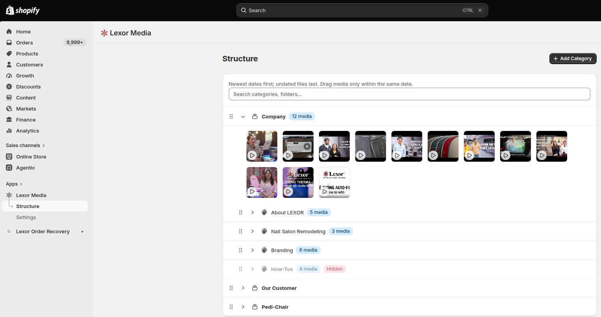
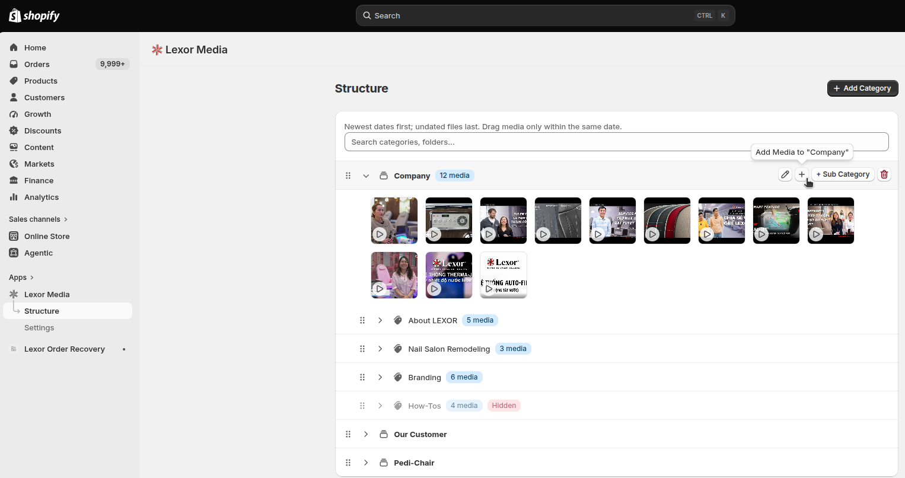
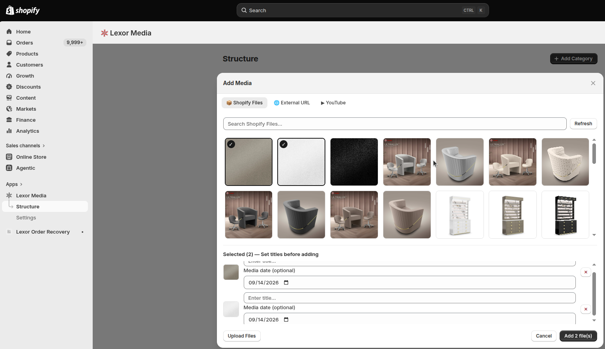
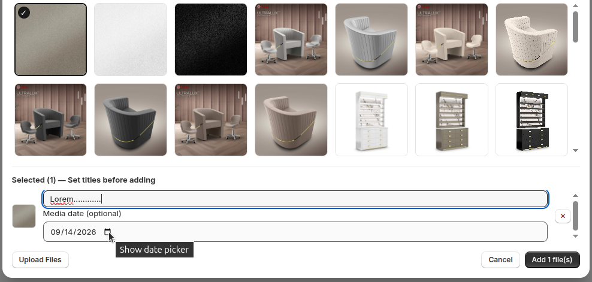
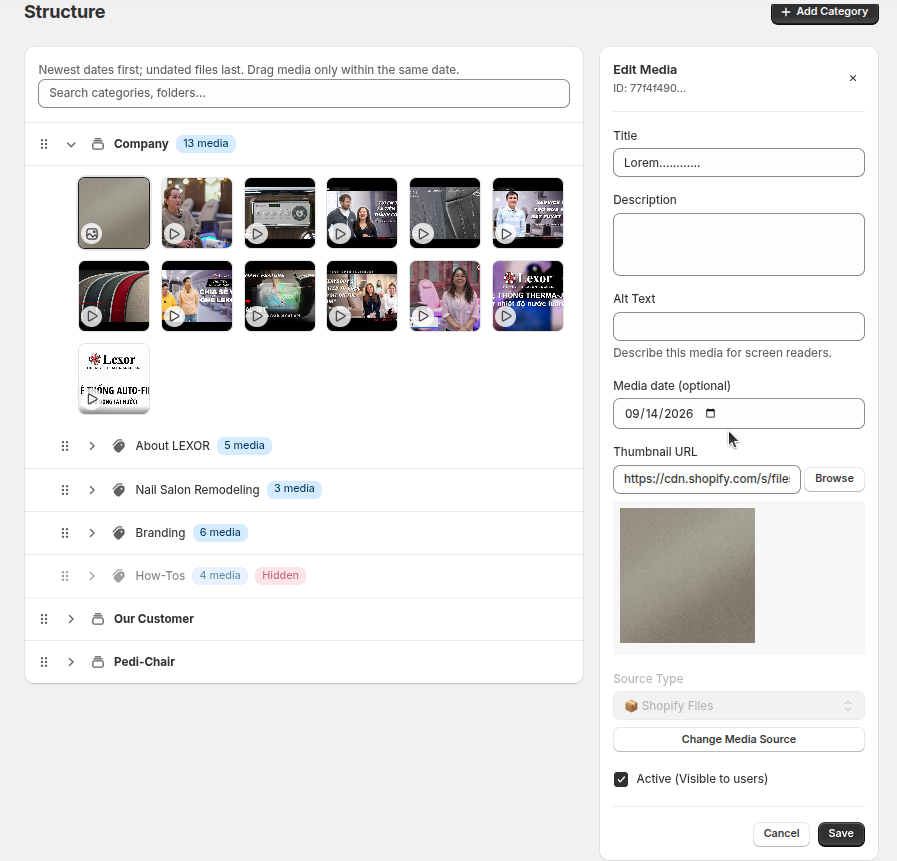
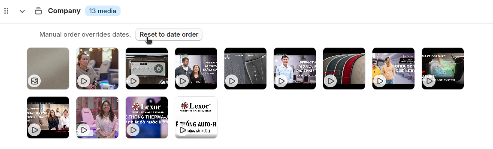
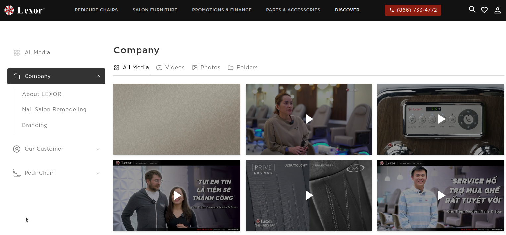

# Hướng dẫn quản lý media dành cho editor

Tài liệu này hướng dẫn editor thêm, cập nhật và sắp xếp hình ảnh/video trong Lexor Media.

## 1. Quy tắc sắp xếp

- Mặc định, media có ngày mới hơn được hiển thị trước media có ngày cũ hơn.
- Hôm nay là ngày muộn nhất có thể chọn. Hệ thống không cho phép chọn ngày trong tương lai.
- Media không có ngày được đưa xuống cuối danh sách.
- Kéo thả có mức ưu tiên cao nhất: vị trí editor kéo chính là vị trí hiển thị, kể cả khi media cũ nằm trên media mới.
- Sau khi kéo, danh sách chuyển sang thứ tự thủ công. File mới import vẫn được chèn vào vị trí phù hợp theo ngày mà không đảo lộn thứ tự đã kéo.
- Nút **Reset to date order** đưa danh sách về lại thứ tự ngày tự động.
- Folder luôn nằm trước media và có thứ tự riêng.
- Thứ tự này được áp dụng trên trang quản trị và gallery ngoài website.

> **Lưu ý về múi giờ:** Hệ thống dùng múi giờ tại trụ sở California (`America/Los_Angeles`). Múi giờ này tự động chuyển đổi giữa PST và PDT.

## 2. Mở trang quản lý

1. Đăng nhập Shopify Admin.
2. Mở app **Lexor Media**.
3. Mở trang **Structure**.
4. Chọn category, sub-category hoặc folder cần quản lý.





## 3. Import từ Shopify Files

### Bước 1: Mở cửa sổ Add Media

1. Tìm category, sub-category hoặc folder muốn thêm media.
2. Bấm **Add Media**.
3. Chọn tab **Shopify Files**.

Media sẽ được thêm vào vị trí đã chọn. Hãy kiểm tra tên category/folder trước khi tiếp tục.



### Bước 2: Chọn file

1. Dùng ô **Search files** để tìm file nếu cần.
2. Bấm vào thumbnail để chọn một hoặc nhiều file.
3. File đã chọn có dấu check trên thumbnail.
4. Bấm lại thumbnail hoặc nút **x** trong danh sách đã chọn để bỏ chọn.
5. Nếu không thấy file mới, bấm **Refresh**.
6. Nếu vẫn còn file chưa hiển thị, bấm **Load More**.

Nút **Upload Files** sẽ mở trang Shopify Files trong tab mới. Sau khi upload lên Shopify, quay lại Lexor Media và bấm **Refresh**.



### Bước 3: Kiểm tra title và ngày

Mỗi file đã chọn có hai trường cần kiểm tra:

- **Title:** tên hiển thị của media. Hệ thống ưu tiên lấy từ alt text của Shopify nếu có.
- **Media date (optional):** ngày dùng để sắp xếp media.

Khi import từ Shopify Files, **Media date** được điền sẵn bằng ngày file được tạo trên Shopify. Đây không phải ngày editor import file vào Lexor Media, cũng không phải ngày chụp trong EXIF.

Ví dụ:

- File được upload lên Shopify ngày `September 10`.
- Editor import vào Lexor Media ngày `September 15`.
- Ngày mặc định của media vẫn là `September 10`.

Editor có thể đổi ngày mặc định nếu nội dung thực tế yêu cầu, nhưng không được chọn ngày trong tương lai.




### Bước 4: Hoàn tất import

1. Kiểm tra title và ngày của tất cả file đã chọn.
2. Bấm **Add file(s)**.
3. Đợi thông báo lưu thành công.
4. Kiểm tra media mới trong category/folder.

Nếu import nhiều file và có file bị lỗi, hệ thống sẽ báo số file thành công và số file thất bại. Không import lại toàn bộ trước khi kiểm tra vì có thể tạo media trùng lặp.

## 4. Chỉnh sửa ngày của media

1. Bấm vào media cần sửa hoặc bấm biểu tượng **Edit**.
2. Tìm trường **Media date (optional)** trong bảng **Edit Media**.
3. Chọn ngày mới.
4. Bấm **Save**.

Để xóa ngày, xóa giá trị trong **Media date (optional)** rồi bấm **Save**. Media không có ngày sẽ nằm cuối danh sách.

Hãy bấm **Save** trước khi chuyển sang media khác. Nếu ngày không hợp lệ, bảng chỉnh sửa sẽ tiếp tục mở để editor sửa ngày.



## 5. Kiểm tra thứ tự theo ngày

Sau khi thêm hoặc sửa media:

1. Tải lại trang nếu danh sách chưa cập nhật.
2. Kiểm tra media có ngày mới nhất nằm trên.
3. Kiểm tra media cũ hơn nằm bên dưới.
4. Kiểm tra media không có ngày nằm cuối.

Ví dụ về thứ tự đúng:

```text
September 15
September 15
September 12
September 01
No date
```

Nếu danh sách đang ở chế độ thủ công (có dòng **Manual order overrides dates**), thứ tự tuân theo vị trí đã kéo thay vì ví dụ trên.


## 6. Kéo thả media (ưu tiên cao nhất)

Kéo thả quyết định trực tiếp vị trí hiển thị và thắng thứ tự ngày tự động.

1. Kéo media đến bất kỳ vị trí nào trong danh sách media, kể cả qua media có ngày khác.
2. Đợi thông báo lưu thành công.
3. Thứ tự đã kéo được giữ nguyên trên trang quản trị và ngoài website.

Lưu ý:

- Không kéo media đè lên folder. Folder luôn đứng trước media và có thứ tự riêng.
- File mới import sau đó vẫn được chèn vào vị trí phù hợp theo ngày, giữ nguyên thứ tự tương đối đã kéo của các file cũ.

### Quay về thứ tự ngày tự động

Khi danh sách đang ở chế độ thủ công, hệ thống hiển thị dòng **Manual order overrides dates** kèm nút **Reset to date order**.

1. Bấm **Reset to date order**.
2. Xác nhận reset.
3. Danh sách quay về sắp xếp ngày mới nhất trước.

> **Slot ảnh 07:** Media đang được kéo qua vị trí có ngày khác, và nút Reset to date order.
>
> Tên file: `docs/images/editor-media/07-same-date-reordering.png`

<!--  -->

## 7. Thêm External URL hoặc YouTube

### External URL

1. Bấm **Add Media**.
2. Chọn tab **External URL**.
3. Điền **Media URL** và **Title**.
4. Điền **Thumbnail URL** nếu cần.
5. Chọn Image hoặc Video.
6. Kiểm tra **Media date (optional)**.
7. Bấm **Add External Media**.

### YouTube

1. Bấm **Add Media**.
2. Chọn tab **YouTube**.
3. Điền YouTube URL và Title.
4. Kiểm tra thumbnail xem trước.
5. Kiểm tra **Media date (optional)**.
6. Bấm **Add YouTube Video**.

Media được thêm bằng URL hoặc YouTube mặc định dùng ngày hôm nay theo múi giờ California. Editor có thể đổi sang ngày cũ hơn trước khi thêm.

## 8. Kiểm tra trên storefront

Sau khi cập nhật media:

1. Mở trang gallery ngoài website.
2. Mở đúng category/sub-category/folder vừa chỉnh sửa.
3. Refresh trang nếu gallery đang mở sẵn.
4. Kiểm tra folder nằm trước media.
5. Kiểm tra media có ngày mới nằm trên media có ngày cũ.
6. Kiểm tra thumbnail, title và video vẫn mở bình thường.

> **Slot ảnh 08:** Gallery storefront sau khi sắp xếp, hiển thị media mới nằm trên.
>
> Tên file: `docs/images/editor-media/08-storefront-result.png`

<!--  -->

## 9. Xử lý lỗi thường gặp

### Không chọn được ngày trong tương lai

Đây là hành vi đúng. Media date chỉ chấp nhận ngày hôm nay hoặc ngày trong quá khứ.

### Ngày của Shopify không giống ngày import

Hệ thống lấy ngày file được tạo trong Shopify Files, không lấy ngày editor import vào Lexor Media.

### Media nằm cuối danh sách

Mở **Edit Media** và kiểm tra **Media date (optional)**. Media đã bị xóa ngày hoặc media cũ chưa từng có ngày sẽ nằm cuối danh sách.

### Danh sách không còn theo ngày sau khi kéo

Đây là hành vi đúng. Lần kéo đầu tiên chuyển danh sách sang thứ tự thủ công. Bấm **Reset to date order** để quay về sắp xếp ngày tự động.

### File mới upload chưa xuất hiện

Trong tab Shopify Files, bấm **Refresh**. Nếu danh sách dài, dùng Search hoặc **Load More**.

### Storefront chưa thay đổi

1. Refresh trang storefront.
2. Kiểm tra media đã được lưu thành công trong admin.
3. Kiểm tra media đang ở đúng category/folder.
4. Kiểm tra tùy chọn **Active (Visible to users)** đang bật.

### Import báo một số file thất bại

Ghi lại thông báo lỗi, kiểm tra file nào đã được tạo thành công, sau đó chỉ import lại file thất bại để tránh trùng lặp.

## 10. Checklist trước khi kết thúc

- [ ] Media nằm đúng category, sub-category hoặc folder.
- [ ] Title rõ ràng và không trùng lặp khi không cần thiết.
- [ ] Media date phù hợp với nội dung.
- [ ] Không có ngày trong tương lai.
- [ ] Thứ tự từ ngày mới đến ngày cũ chính xác, hoặc thứ tự kéo thủ công đúng ý đồ.
- [ ] Nếu đã kéo thủ công, nút **Reset to date order** chỉ dùng khi muốn quay về tự động.
- [ ] Thumbnail hiển thị bình thường.
- [ ] Tùy chọn Active được bật nếu media cần hiển thị trên website.
- [ ] Storefront hiển thị đúng sau khi refresh.

## 11. Thêm ảnh vào tài liệu

Đặt screenshot vào thư mục:

```text
docs/images/editor-media/
```

Dùng đúng tên file ghi tại mỗi slot. Sau đó mở file tài liệu và bỏ dấu comment `<!--` và `-->` quanh dòng ảnh tương ứng.

Trước khi chụp ảnh:

- Chỉ chụp khu vực cần hướng dẫn.
- Che email, thông tin khách hàng và dữ liệu nhạy cảm.
- Dùng cùng một kích thước cửa sổ để bộ ảnh đồng đều.
- Nếu có thể, dùng khung ngang rộng tối thiểu 1200 px.
- Đảm bảo chữ, ngày và tên nút dễ đọc.
